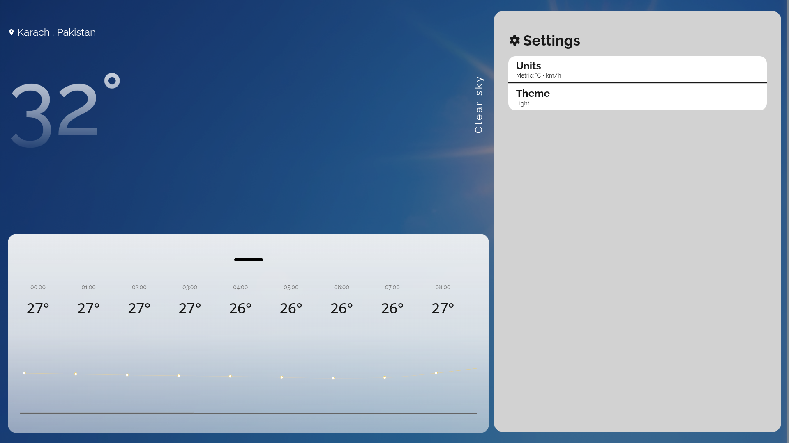
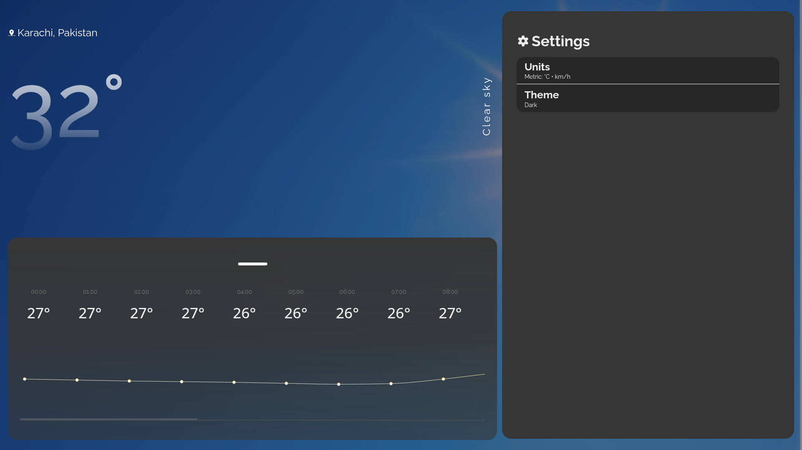

<div align="center">
  <h1>Weather Data Platform</h1>
</div>
A production-style, containerized data engineering platform built with Apache Airflow, FastAPI, PostgreSQL, and Docker. The platform automates weather data ingestion, transformation, validation, and storage through ELT pipelines, while exposing processed data through Fastapi APIs and an interactive frontend dashboard.
Hence, providing both the local and online (AWS) deployment. 

<br>

<p align="center">
<a href="https://github.com/muneebIsLOL/Weather-Data-Platform/releases"></a>


</p>

<div style="display:flex; width:100%;">
  
</div>

## Features
- Automatically extracts weather from the `Open-Meteo` api.
- Orchestrates an end-to-end ELT pipeline using an orchestrator library.
- Separates raw and processed weather datasets.
- Validates weather data before loading it into the database.
- Stores weather information in a structured PostgreSQL database.
- Exposes processed weather data through RESTful API endpoints.
- Displays weather information in a responsive dashboard.
- Supports current, hourly, and daily weather forecasts.
- Maintains local backups of extracted datasets.
- Runs as a fully containerized application for consistent deployment.

## Quick Start

> [!Note] (Optional) Configure Environment
> - After cloning the repo, grab the variables from `.env.example`.
> - Make an environment file and name it `.env.production`.
> - Paste the variables from `.env.example` and tailor it according to your needs.

### Download Docker (Prerequisites)
**1. Linux (Ubuntu / Debian):**

Download and run the install script
```bash
# Download the docker installation script
curl -fsSL https://get.docker.com -o get-docker.sh

# Run the script as administrator
sudo sh get-docker.sh
```

Manage Docker as a non-root user

```bash
sudo usermod -aG docker $USER
newgrp docker
```

**2. macOS (Intel / Apple Silicon)**

**Download the Installer**

Go to the official download page and select the version that matches your Mac's processor:

`https://docs.docker.com/desktop/setup/install/mac-install/`

- **Mac with Apple Silicon:** Choose this if your Mac uses an M1, M2, M3, or M4 chip.
- **Mac with Intel chip:** Choose this if you have an older Intel-based Mac.2

**Install the Application**
- Double-click the downloaded .dmg file to open it.
- Drag the Docker icon into your Applications folder.
- Open your Applications folder and double-click Docker to launch it.

**Complete Setup**
- macOS will ask you to authorize Docker Desktop with your system password. This is required to install its networking and privileged helper tools.
- Follow the on-screen onboarding steps and accept the service agreement.

**3. Windows**

**Prerequisite: Enable WSL 2**

Docker Desktop on Windows performs best using the Windows Subsystem for Linux (WSL 2) backend.

- Open PowerShell or Command Prompt as an Administrator.
- Run the following command to ensure WSL is installed and updated:
  - ``wsl --install``
- Restart your computer if prompted.

**Download and Install**
- Download the installer from the official Docker Desktop for Windows page.
- Double-click Docker Desktop Installer.exe to run it.
- When prompted, ensure the "Use WSL 2 instead of Hyper-V" option is checked.
- Click OK and let the installation finish, then click Close and restart to reboot your computer.

**Launch Docker**
- After your PC restarts, launch Docker Desktop from your Start Menu.
- Accept the Docker Subscription Service Agreement.

<br>
Once Docker Desktop is running (you will see a solid green whale icon in your menu bar or system tray), open your terminal (Terminal on Mac, or PowerShell / Command Prompt on Windows) and verify that both Docker and Compose are ready:

<br>

```bash
docker --version
docker compose version
```

### Start the Application
Open the terminal/powershell and run the subsequent commands:

#### Clone the Repository
1. ClI Method (if git is installed):

```bash
git clone https://github.com/muneebIsLOL/Weather-Data-Platform
```

2. GUI Method

- Head over to `https://github.com/muneebIsLOL/Weather-Data-Platform`
- Click on the releases & download the latest release.
- Extract the zip inside the `Weather-Data-Platform` folder

#### Run the Script

```bash
# Access the application dir
cd Weather-Data-Platform

# Initialize the script
./run.sh
```

#### Access the Application (Frontend)
- **Frontend (GUI):** `localhost:5173` 
- **Backend (API):** `localhost:8000` 
- **Airflow (Orchestrator):** 
  - ***URL:*** `localhost:8080` 
  - *Username:* admin
  - *Password:* airflow

If the application loads successfully, the Weather Data Platform has been deployed correctly and is ready to use.

For component-specific information, refer to:

- `backend/README.md`
- `frontend/README.md`
